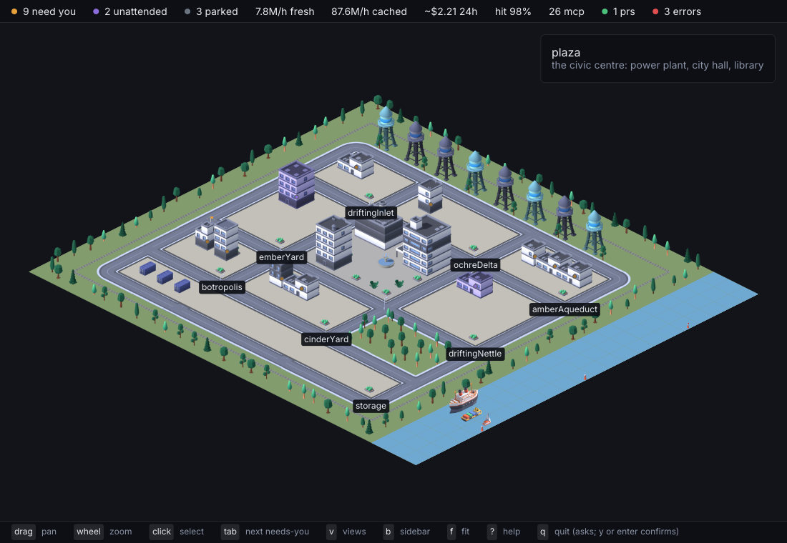

# Botropolis

Every Claude Code session on this machine, drawn as a city.
Districts are projects, buildings are sessions, and everything on the map means one thing you can read by hovering it.




## Start here

```
systemctl --user enable --now botropolisd   # the daemon: inotify on ~/.claude plus hook pushes, on a unix socket
botropolis install-hooks                    # botropolis-hook into ~/.claude/settings.json (backup kept)
botropolis doctor                           # the daemon, the hooks, a terminal, the claude CLI, the display
botropolis                                  # the city
```

Then one line in `~/.bashrc`:

```
source /usr/share/botropolis/botropolis.bash
```

That line is the one that changes how you work.
Every session becomes a `claude --bg` job you can close, reopen, park and wake from the map, and the terminal is only ever a view of it.

Sessions live in Claude Code's own background daemon;
Botropolis starts them, opens them in a terminal, parks them and wakes them, and never writes to `~/.claude` itself.

## What you see

One district per project, one building per session, and every object stands for one datum.
A building's height is its context window used and its beacon is its state — needs-you amber, working blue, waiting teal, unattended violet, parked slate.
A rover works at the door while a session is mid-turn, a drone circles the roof for each subagent in flight, a flag flies per PR (green once merged) and smoke rises per API error.
A vacant plot is a session nothing has been typed into yet: never counted, and `botropolis prune` clears it after an hour.

The plant on the plaza is the API — click it for the breakdown by model, project and session over an hour, a day or a week.
The towers on the ridge are MCP servers, the library ranks skills, and the city hall carries Claude Code's own rollup.
Parked sessions are containers in the storage yard, one colour per project.
Avenues carry traffic between projects whose sessions message each other or edit each other's files.
The wires from the plant carry each session's live token rate;
a session with no wire is one the daemon has seen no hook events from, so it is reading files.
The freight loop round the city is the ledger: one train per model, a wagon per unit of the day's tokens.
A new session arrives on a tug up the river and its building rises once it docks;
one you demolish leaves downriver.

The strip along the top is the city's tallies and the sidebar (`b`) is the same thing as a list.
The timeline (`t`) is the daemon's event log, so it survives the window closing:
when the city opens or comes back into focus, "while you were away" lists what needed you or went wrong since it was last seen.

A building's card has a **summary** button (`i` from the keyboard).
It shows the recap Claude Code writes at the foot of a session left waiting, with how old it is and how many turns the session has taken since.
A session with no recap shows its last prompt instead,
and a **generate summary** button that asks your own `claude` CLI for one.
That is the only thing on the map that spends tokens, and only when you press it:
it runs Haiku with no tools, no MCP servers and no hooks, writes no transcript, and never appears in the city as a session.

Keys: drag to pan, wheel to zoom, `r` to turn, `f` to fit, `tab` for the next session that needs you, `enter` to attach it, `i` its summary,
`c` for a new session here, `d d` to demolish, `b` sidebar, `x` breakdown, `t` timeline, `/` search, `s` settings, `n` night/day/live, `[` `]` scrub the clock,
`h` hide the UI, `p` save a frame, `?` all of them.

## Installing

Packages for each release are on the [releases page](https://github.com/auroq/botropolis/releases), built by CI from the commit they are tagged at.

```
sudo dpkg -i botropolis_0.1.0_amd64.deb          # Debian, Ubuntu
sudo rpm -i botropolis-0.1.0.x86_64.rpm          # Fedora, RHEL, openSUSE
sudo pacman -U botropolis-0.1.0-x86_64.pkg.tar.zst   # Arch
botropolis --version                             # should print the version you installed
```

Every package installs the three binaries, both systemd user units, the desktop entry and icon, the shell integration, and the licences for the artwork and the typeface that are compiled in.
`SHA256SUMS` is published beside them.

There is also a plain tarball if you would rather not install anything, and `make build` puts the three binaries in `bin/` from a checkout.

## Running it

The package installs `botropolis.desktop`, so the city is in your launcher under "Botropolis".

`botropolis` opens the city and `botropolis --tui` the terminal table.
`botropolis new <dir> [prompt]`, `attach <id>`, `stop <id>`, `resume <session-id>`, `rm <id>` and `prune` wrap the `claude` CLI;
`status` prints the table, `events --since 2h` the daemon's log, and `install-hooks --remove` takes the hook out again.
`--direct` skips the daemon.

`botropolis city --screenshot city.png` renders one frame and exits;
`--headless` runs it on a virtual display so no window opens, `--keys n,n,x` presses keys first, and `--record dir --seconds 24` writes frames for a GIF (`make gif`).
`--window 1920x1080` sizes the window and `--fps 30` records smoother frames.
Media for the website is filmed from recorded demo sessions rather than anyone's real ones: see [demo/](demo/README.md).

Settings come from flags, then `BOTROPOLIS_HOME`, `BOTROPOLIS_SOCKET`, `BOTROPOLIS_TERMINAL`, `BOTROPOLIS_PARKED_DAYS`, `BOTROPOLIS_CODEX_HOME`,
then `~/.config/botropolis/config.{toml,yaml,json}` (`home`, `socket`, `terminal`, `hook_command`, `parked_days`, `codex_home`, `projection`, `render_scale`, `reduced_motion`, `daily_budget_usd`).
`s` in the city opens a settings panel for the same keys and writes the file back.

A waybar module, for example:

```json
"custom/botropolis": { "exec": "botropolis bar --watch", "return-type": "json", "on-click": "botropolis" }
```

See [DESIGN.md](DESIGN.md) for the design and the rules, [ROADMAP.md](ROADMAP.md) for where it is going,
and [docs/usage-profile.md](docs/usage-profile.md) for the numbers it is built around.

[CONTRIBUTING.md](CONTRIBUTING.md) is how the repository works, [CHANGELOG.md](CHANGELOG.md) is what changed,
[SECURITY.md](SECURITY.md) says what Botropolis touches and how to report anything exploitable,
and [CODE_OF_CONDUCT.md](CODE_OF_CONDUCT.md) applies to everyone here.
Botropolis is MIT licensed; see [LICENSE](LICENSE).

## Thanks

**Botropolis exists because of [bot-crossing](https://github.com/jarrenrocks/bot-crossing) by [Jarren Rocks](https://jarren.rocks).**
He had the idea first: that the agent sessions on your machine are a place, and that a place is easier to read at a glance than a list.
His is a 3D colony in the browser where every thread is an astronaut, and it is worth your time.
Thank you, Jarren.

Two of its ideas are kept here outright.
A **per-harness adapter seam**, so the thing that reads sessions is not welded to one vendor.
And a **sticky layout**, because a map is only useful if you can learn it, and a map that rearranges itself has taught you nothing.

Everything else is different, and the differences are choices rather than improvements:

| | bot-crossing | botropolis |
| --- | --- | --- |
| runs as | a browser app on a local HTTP server | a native binary |
| covers | Claude Code, Codex and Cursor | Claude Code only |
| a session is | a thread it reads and opens through the desktop app | a `claude --bg` job it starts, parks and wakes; terminals are views of it |
| size means | transcript bytes, on a log scale | nothing — every object stands for one datum you can hover |
| drawn with | three.js at runtime, in 3D | 2D sprites pre-rendered from 3D kits, Factorio-style |

The reason for all of it is [docs/usage-profile.md](docs/usage-profile.md).
This machine runs CLI-only, several sessions at once, with context as the scarce resource — a profile the desktop app's focus-and-unread bookkeeping never fitted.
None of that makes bot-crossing wrong;
it makes it a different program for a different desk, and it was the one that showed the idea works.

The city is drawn from [Kenney](https://kenney.nl)'s 3D kits — City Kit Commercial, Roads, Industrial and Suburban, the Nature Kit, the Car Kit, the Space Kit, the Train Kit and the Watercraft Kit, all CC0 —
pre-rendered once in Blender by `tools/render-sprites` into the atlases under `pkg/assets/kits/` (four headings, two zoom levels),
the way Factorio ships its sprites: the runtime only ever draws 2D.
The 16 px Tiny Town, Tiny Factory and Roguelike Modern City packs remain behind `--projection top`.
Thank you, Kenney; see [`pkg/assets/kenney/README.md`](pkg/assets/kenney/README.md) and [`pkg/assets/kits/README.md`](pkg/assets/kits/README.md) for the packs, versions and terms,
and [support the studio](https://kenney.nl/donate) if the work helps you too.

The chrome is set in [Inter](https://rsms.me/inter/) by Rasmus Andersson, embedded from `pkg/assets/fonts` under the SIL Open Font License 1.1
(the licence text ships beside the face).

## Not doing

Planets, orbit mode, a 3D renderer, network serving, quality presets beyond render scale and reduced motion, animated faces.
Each is either bot-crossing's setting rather than a feature, or a cost the footprint principle rules out.

## Tools

`tools/analyze-history.py` summarises Claude Code usage from `~/.claude/projects`.
Read-only, stdlib only.

`tools/make-fixtures.py` copies a scrubbed slice of `~/.claude` into `testing/helpers/fixtures/<name>/home/`, laid out like a `$HOME` so tests can point the read model at it.
Ids, timestamps and `usage` are kept;
prompts, tool text, titles and account identifiers become deterministic placeholders,
and project paths, branches, PR repositories and MCP server names are renamed to stable aliases that keep their shape, their nesting and their distinctness.
A fixture is safe to share, and a frame rendered from one shows the city without showing whose it is.
Fixtures are not committed:
`make test-integration` and `make test-acceptance` regenerate the default `sample` fixture first, and the tests skip on a machine without `~/.claude`.

Both take `--help`.
